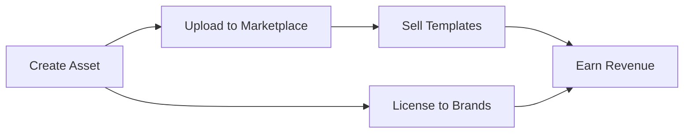

## Overview

VFX Studios provides powerful tools to streamline your visual content creation. You can generate AI-driven assets, organize setlists and storyboards, receive real-time suggestions, and access a vibrant marketplace. These features work together to support DJs, YouTubers, filmmakers, and more in producing professional visuals efficiently.

<Callout kind="tip">
Start with AI asset generation to quickly prototype ideas, then organize them into setlists or storyboards.
</Callout>

## Key Features at a Glance

<Columns cols={3}>
  <Card title="AI Asset Generation" icon="zap" href="#ai-assets">
    Create custom visuals from audio, mood, or briefs using AI.
  </Card>
  <Card title="Setlist Organizer" icon="list" href="#setlist-tools">
    Drag-and-drop planning for live performances.
  </Card>
  <Card title="Storyboard Creator" icon="image" href="#storyboard-tools">
    Visualize video content from start to finish.
  </Card>
  <Card title="Real-time Suggestions" icon="brain" href="#real-time">
    AI adapts visuals based on live feedback.
  </Card>
  <Card title="Asset Marketplace" icon="shopping-bag" href="#marketplace">
    Buy, sell, and monetize your creations.
  </Card>
</Columns>

## AI-Driven Asset Generation

Generate bespoke visual effects tailored to your needs. Provide an audio track, mood description, or creative brief, and the AI produces ready-to-use assets.

### Quick Start Steps

<Steps>
  <Step title="Prepare Input" icon="upload">
    Upload an audio file or enter a text prompt like "energetic beat with neon glows".
  </Step>
  <Step title="Generate Assets" icon="zap">
    Click Generate. The AI processes and delivers multiple variations in seconds.
  </Step>
  <Step title="Refine and Download" icon="edit-3">
    Edit parameters and export in formats like MP4 or GIF.
  </Step>
</Steps>

For programmatic access, use the API:

<CodeGroup tabs="JavaScript,Python">
  ```javascript
  const response = await fetch('https://api.example.com/v1/assets/generate', {
    method: 'POST',
    headers: { 'Authorization': 'Bearer YOUR_API_KEY', 'Content-Type': 'application/json' },
    body: JSON.stringify({
      prompt: 'neon visuals for upbeat track',
      audioUrl: 'https://your-audio.com/track.mp3',
      style: 'vaporwave'
    })
  });
  const assets = await response.json();
  ```
  ```python
  import requests
  response = requests.post(
      'https://api.example.com/v1/assets/generate',
      headers={'Authorization': 'Bearer YOUR_API_KEY', 'Content-Type': 'application/json'},
      json={
          'prompt': 'neon visuals for upbeat track',
          'audioUrl': 'https://your-audio.com/track.mp3',
          'style': 'vaporwave'
      }
  )
  assets = response.json()
  ```
</CodeGroup>

<ParamField path="prompt" param-type="string" required="true">
  Descriptive text for the desired visual style.
</ParamField>

<ParamField query="style" param-type="string" required="false">
  Preset styles like `vaporwave` or `cyberpunk`.
</ParamField>

## Setlist and Storyboard Tools

Organize your content with intuitive interfaces.

<Tabs>
  <Tab title="Setlist Organizer" icon="music">
    Plan live performances by dragging assets into sequences. Adjust timing and transitions visually.

    ```javascript
    // Save a setlist via API
    await fetch('https://api.example.com/v1/setlists', {
      method: 'POST',
      headers: { 'Authorization': 'Bearer YOUR_API_KEY' },
      body: JSON.stringify({
        name: 'Live Set 2024',
        assets: ['asset1.mp4', 'asset2.gif']
      })
    });
    ```
  </Tab>
  <Tab title="Storyboard Creator" icon="layers">
    Build video narratives frame by frame. Add notes, durations, and previews.

    <Image
      src="https://via.placeholder.com/800x400/22C55E/white?text=Storyboard+Preview"
      alt="Storyboard interface showing frames and timelines"
      width="800"
      height="400"
    />
  </Tab>
</Tabs>

## Real-time AI Suggestions

During live performances, AI analyzes audience reactions and audio to suggest visual adaptations instantly.

<Expandable title="Advanced Configuration" default-open="false">
  Customize sensitivity:

  ```
  {
    "audioAnalysis": true,
    "crowdReaction": "high",
    "autoSwitchInterval": 30
  }
  ```

  Upload this JSON to your performance settings for tailored responses.
</Expandable>

## Asset Marketplace Access

Monetize your work through 15 avenues like selling templates or partnering with brands.

<Callout kind="success">
  New creators earn from day one by listing assets publicly.
</Callout>



### Next Steps

<Columns cols={2}>
  <Card title="API Reference" icon="code" href="/authentication">
    Integrate features programmatically.
  </Card>
  <Card title="Monetization Guide" icon="dollar-sign" href="/quickstart">
    Maximize earnings.
  </Card>
</Columns>