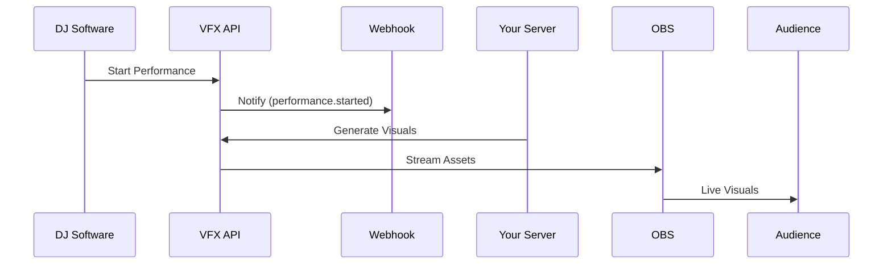

## Overview

Integrate VFX Studios with your favorite tools to automate workflows, sync assets, and enhance live performances. Use webhooks for real-time notifications, the REST API for custom automation, and third-party apps for seamless collaboration.

<Callout kind="tip">
Enable integrations in your account settings at `https://dashboard.vfxstudios.com/settings/integrations`.
</Callout>

## Popular Third-Party Integrations

Connect VFX Studios to tools you already use. Set up these integrations directly from the dashboard.

<Columns cols={3}>
  <Card title="OBS Studio" icon="monitor" href="https://obsproject.com" target="_blank">
    Stream visuals directly into OBS for live broadcasts and VJ sets.
  </Card>
  <Card title="Ableton Live" icon="music" href="https://ableton.com" target="_blank">
    Sync AI-generated loops with your MIDI tracks for dynamic performances.
  </Card>
  <Card title="Discord" icon="message-circle" href="https://discord.com" target="_blank">
    Share assets and get real-time feedback in your creator communities.
  </Card>
</Columns>

## Webhook Setup

Webhooks notify external services when events occur, such as new asset creation or performance starts.

### Prerequisites

- Generate a webhook secret in dashboard settings.
- Expose a public HTTPS endpoint to receive payloads.

<Steps>
  <Step title="Create Webhook" icon="settings">
    Navigate to `https://dashboard.vfxstudios.com/settings/webhooks` and click "New Webhook".

    Enter your endpoint URL, e.g., `https://your-webhook-url.com/vfx-events`.

    Select events like `asset.created` or `performance.started`.
  </Step>
  <Step title="Verify Endpoint" icon="check-circle">
    Test the webhook with the provided sample payload.
  </Step>
  <Step title="Handle Payloads" icon="code">
````javascript
// Example Node.js handler
app.post('/vfx-events', (req, res) => {
  const event = req.body;
  if (event.type === 'asset.created') {
    console.log(`New asset: ${event.data.name}`);
    // Trigger your workflow
  }
  res.status(200).send('OK');
});
````
  </Step>
</Steps>

<Callout kind="alert">
Always validate webhook signatures using the shared secret to prevent unauthorized requests.
</Callout>

## API Reference

Access VFX Studios data programmatically. Base URL: `https://api.vfxstudios.com/v1`.

### Authentication

Use Bearer tokens obtained from the dashboard.

<ParamField header="Authorization" param-type="string" required="true">
`Bearer YOUR_API_TOKEN`
</ParamField>

<ParamField query="api_key" param-type="string" required="false">
Fallback authentication for public endpoints.
</ParamField>

### List Assets

Retrieve your generated assets.

<Request tabs="cURL,JavaScript,Python" show-lines="true">
````bash
curl -X GET "https://api.vfxstudios.com/v1/assets" \
  -H "Authorization: Bearer YOUR_API_TOKEN"
````
````javascript
const response = await fetch('https://api.vfxstudios.com/v1/assets', {
  headers: { 'Authorization': 'Bearer YOUR_API_TOKEN' }
});
const assets = await response.json();
````
````python
import requests
response = requests.get('https://api.vfxstudios.com/v1/assets', headers={
  'Authorization': 'Bearer YOUR_API_TOKEN'
})
assets = response.json()
````
</Request>

<Response tabs="200">
````json
{
  "assets": [
    {
      "id": "asset_123",
      "name": "Audio Reactive Loop",
      "url": "https://cdn.vfxstudios.com/assets/asset_123.mp4",
      "created_at": "2024-10-15T10:00:00Z"
    }
  ],
  "total": 1
}
````
</Response>

## Workflow Examples

Customize integrations for your use case.

<Tabs>
  <Tab title="Live Performance" icon="zap">
    Automate visuals during DJ sets.



    Use webhooks to trigger OBS scene switches on beat detection.
  </Tab>
  <Tab title="Content Pipeline" icon="video">
    Streamline YouTube video production.

    <Steps>
      <Step title="Storyboard to Asset">
        Generate storyboard via API, then create matching visuals.
      </Step>
      <Step title="Export to Editor">
        Download assets and import into Premiere Pro.
      </Step>
    </Steps>
  </Tab>
</Tabs>

## Next Steps

<Columns cols={2}>
  <Card title="API Reference" icon="book-open" href="/api-reference">
    Full endpoint documentation.
  </Card>
  <Card title="Custom Scripts" icon="code" href="/guides/custom-scripts">
    Build advanced automations.
  </Card>
</Columns>